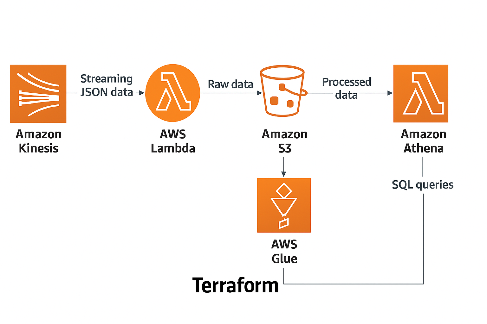
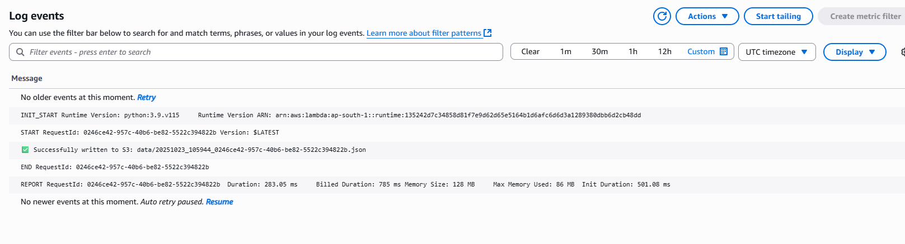
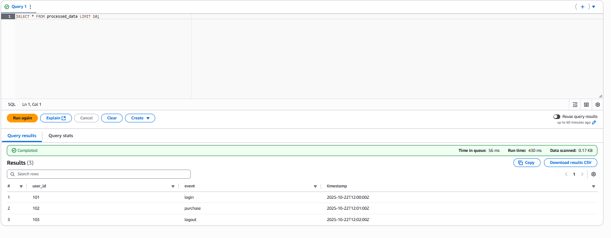

# ☁️ AWS Serverless Data Pipeline — Kinesis | Lambda | Glue | S3 | Athena


> Built a **real-time, serverless data pipeline** using **Terraform** — for event-driven ingestion, transformation, and analytics on AWS.

---

## Table of Contents
- [Overview](#overview)
- [Architecture](#architecture)
- [Technologies Used](#technologies-used)
- [Features](#features)
- [Project Structure](#project-structure)
- [Prerequisites](#prerequisites)
- [Setup Instructions](#setup-instructions)
- [Screenshots](#screenshots)
- [Contact](#contact)

---

## Overview
This project implements a **fully serverless data pipeline** for both **real-time** and **batch data processing** using **AWS services** and **Terraform**.

It demonstrates how to:
- Ingest streaming JSON events using **Amazon Kinesis**
- Process and store raw data with **AWS Lambda** into **Amazon S3**
- Transform data with **AWS Glue (PySpark ETL)**
- Query insights via **Athena** and visualize with **QuickSight**

---

## Architecture



### Workflow
```
Kinesis (Stream Ingestion)
     ↓
Lambda (Process Events)
     ↓
S3 (Data Lake: Raw Layer)
     ↓
AWS Glue (ETL Transformation)
     ↓
S3 (Processed Layer / Parquet)
     ↓
Athena (SQL Analytics)
```

---

## Technologies Used

| Category | AWS Service / Tool | Purpose |
|-----------|--------------------|----------|
| Ingestion | **Amazon Kinesis** | Streams real-time JSON log data |
| Processing | **AWS Lambda** | Processes and stores raw JSON events |
| Storage | **Amazon S3** | Data lake (raw + processed zones) |
| Transformation | **AWS Glue (PySpark)** | Cleans and converts JSON → Parquet |
| Analytics | **AWS Athena** | Serverless SQL queries |
| Infrastructure as Code | **Terraform** | Automates resource provisioning |
| Monitoring | **CloudWatch** | Logs and metrics for Lambda & Glue |
| Security | **IAM** | Role-based access control |

---

## Features
- **Event-Driven Design**: Lambda triggered by Kinesis Data Stream.
- **ETL Pipeline**: Automated Glue job for data transformation.
- **Data Lake Architecture**: Raw and Processed S3 buckets.
- **Schema-Driven Queries**: Glue Catalog + Athena integration.
- **Serverless Analytics**: Query with Athena, visualize with QuickSight.
- **Secure + Encrypted Storage**: S3 buckets with AES256 encryption.
- **Fully Automated via Terraform**.
- **Free-Tier Friendly** for experimentation.

---

## Project Structure
```
AWS-SERVERLESS-DATA-PIPELINE/
├── glue/
│   └── etl_job.py                # Glue ETL script (PySpark)
├── lambda/
│   ├── process_stream.py         # Lambda for processing Kinesis records
│   └── process_stream.zip        # Packaged Lambda for deployment
├── terraform/
│   ├── main.tf                   # Core infrastructure (S3, Kinesis, Glue, IAM)
│   ├── lambda.tf                 # Lambda + Kinesis trigger config
│   ├── outputs.tf                # Terraform output values
│   ├── variables.tf              # Variable definitions
│   ├── test_data.json            # Sample streaming data
├── screenshots/
│   ├── cloudwatch-logs.png       # CloudWatch logs (Lambda)
│   ├── athena-results.png        # Athena query results
│   ├── architecture.png          # Architecture diagram
└── README.md
```

---

## Prerequisites

### Required Tools
- AWS Account with access to S3, Kinesis, Lambda, Glue, Athena
- Terraform v1.9+  
  ```bash
  terraform --version
  ```
- AWS CLI configured  
  ```bash
  aws configure
  # Enter Access Key, Secret Key, Region (e.g., ap-south-1)
  ```
- Python 3.9+ installed (for Lambda + Glue scripting)
- IAM user/role with permissions for:
  - Lambda, S3, Glue, Kinesis, Athena, CloudWatch

---

## Setup Instructions

### 1️⃣ Clone Repository
```bash
git clone https://github.com/PrajwalRedee/aws-serverless-data-pipeline.git
cd aws-serverless-data-pipeline/terraform
```

### 2️⃣ Initialize Terraform
```bash
terraform init
```

### 3️⃣ Review Deployment Plan
```bash
terraform plan
```

### 4️⃣ Deploy Infrastructure
```bash
terraform apply -auto-approve
```

### 5️⃣ Upload Glue Script
```bash
aws s3 cp ../glue/etl_job.py s3://<raw_bucket_name>/scripts/etl_job.py
```

### 6️⃣ Send Test Data to Kinesis
```bash
aws kinesis put-record \
--stream-name log-stream \
--partition-key testKey \
--data file://test_data.json
```

### 7️⃣ Run Glue ETL Job
```bash
aws glue start-job-run --job-name etl_raw_to_processed
```

### 8️⃣ Query in Athena
```sql
SELECT * FROM processed_data LIMIT 10;
```

### 9️⃣ (Optional) Visualize in QuickSight
Connect Athena dataset → Build dashboard for insights.

---

## Screenshots

### ☁️ Architecture Diagram


### 🧩 CloudWatch Logs


### 📊 Athena Query Results


---

## Contact
**K Prajwal**  
Associate DevOps Engineer | AWS & DevOps Enthusiast  

📧 [prajwalredee@gmail.com](mailto:prajwalredee@gmail.com)  
🔗 [linkedin.com/in/prajwalredee](https://www.linkedin.com/in/prajwalredee)  
🐙 [github.com/PrajwalRedee](https://github.com/PrajwalRedee)  
📍 Bangalore, India  

