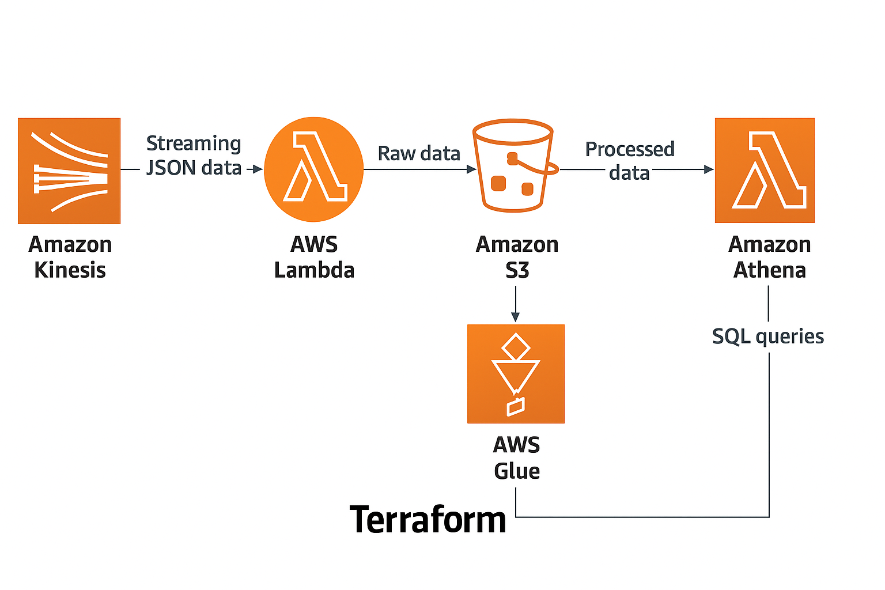
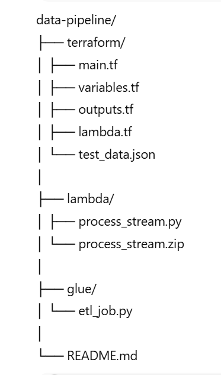
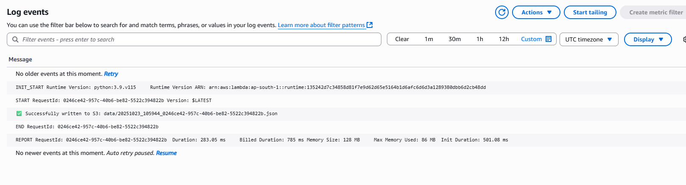
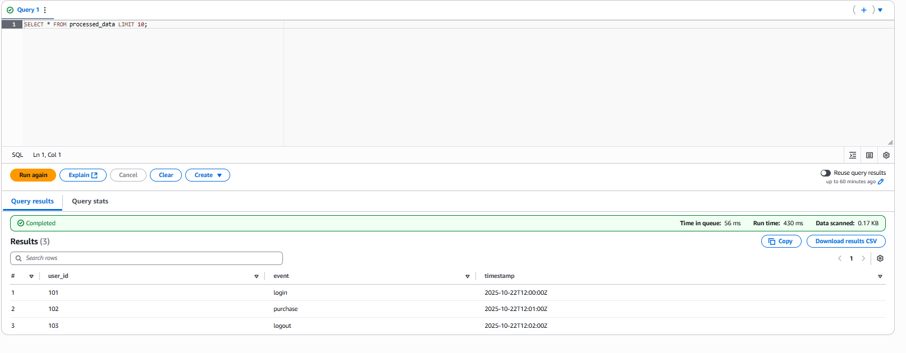

# ☁️ AWS Serverless Data Pipeline (Kinesis + Lambda + Glue + S3 + Athena)

This project demonstrates a **real-time, serverless data pipeline** built entirely on AWS using **Terraform**.  
It ingests streaming JSON data with **Kinesis**, processes it via **Lambda**, stores it in **S3**, transforms it with **AWS Glue (PySpark)**, and queries it in **Athena**.

| Service | Purpose |
|----------|----------|
| **Amazon Kinesis** | Stream real-time data |
| **AWS Lambda** | Process events and push to S3 |
| **Amazon S3** | Store raw and processed data (data lake) |
| **AWS Glue** | ETL transformation with PySpark |
| **AWS Athena** | Query processed Parquet data |
| **AWS IAM** | Security roles and access management |
| **Terraform** | Infrastructure as Code for full automation |

## Architecture Overview

## Project Structure

---

## Step-by-Step Setup Instructions

1️⃣ Initialize Terraform
    
    cd terraform
    terraform init

2️⃣ Plan Deployment

    terraform plan

3️⃣ Apply Infrastructure

    terraform apply -auto-approve

4️⃣ Copy etl_job.py to S3 bucket

    cd glue
    aws s3 cp etl_job.py s3://{raw_data_bucket_name}/scripts/etl_job.py

5️⃣ Send Test Data

    aws kinesis put-record `
    --stream-name log-stream `
    --partition-key testKey `
    --data file://test_data.json

6️⃣ Run Glue Job

    aws glue start-job-run --job-name etl_raw_to_processed

7️⃣ Query in Athena

    SELECT * FROM processed_data LIMIT 10;

## Sample Output

